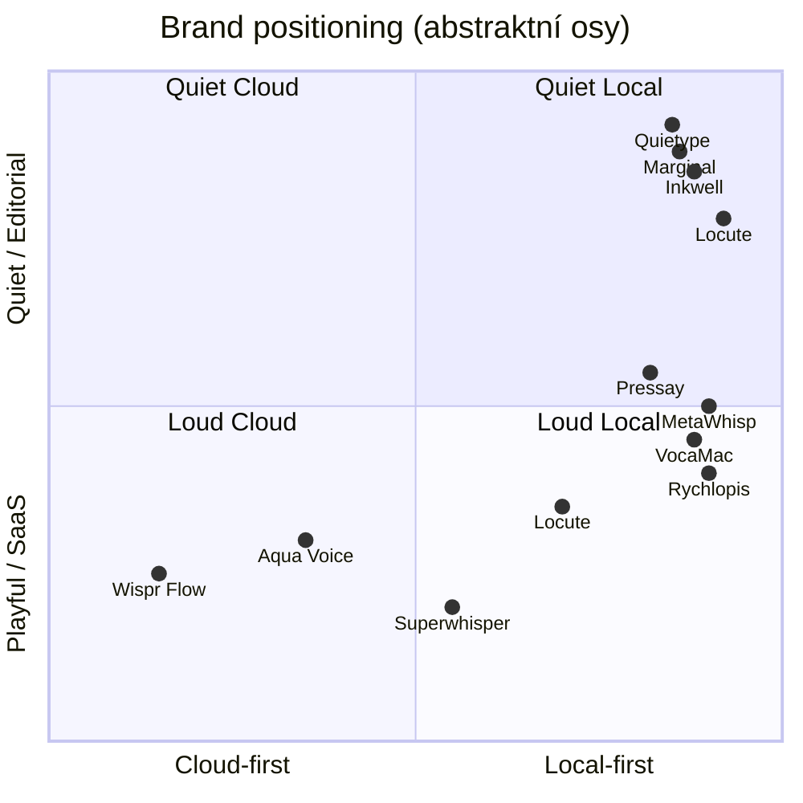

# Analýza brandových názvů — rozšířená sada

> Datum: 2026-05-30  
> Kontext: macOS menu bar diktování · **rychlost + přesnost** · **offline po setupu** · UI **EN + CS** · vizuál **Quiet Study** (claret, cream, „)  
> Vstup: [COMPETITIVE_ANALYSIS.md](./COMPETITIVE_ANALYSIS.md), [PRODUCT.md](../../PRODUCT.md)

---

## 1. Kritéria hodnocení (1–5, vyšší = lepší)

| Kód | Kritérium | Co měří |
|-----|-----------|---------|
| **EN** | Angličtina | Výslovnost, přirozenost, B2B |
| **CS** | Čeština | Bez trapasů, zapamatovatelnost |
| **SP** | Speed / Precision | Sedí k claimu rychlý + přesný přepis |
| **LO** | Local / trust | Evokuje „na Macu“, ne cloud |
| **VS** | Visual fit | Quiet Study, ne AI slop / hacker dark |
| **DI** | Differentiation | Odlišení od Wispr, Aqua, Super, Glimpse, **VocaMac** |
| **CO** | Conflict risk | Obsazenost jména (nízké = 5) |

**Σ** = součet (max 35). **Tier** = A ≥28, B 24–27, C 20–23, D &lt;20.

---

## 2. Obsazený prostor (z researchu + rychlý scan)

| Název / rodina | Kdo | Důsledek pro vás |
|----------------|-----|------------------|
| Flow, Wispr | Wispr Flow | Vyhnout *Flow* |
| Aqua, Avalon | Aqua Voice | Vyhnout *Aqua* |
| Super, Whisper | Superwhisper | Vyhnout *Super*, *Whisper* |
| Glimpse | OSS local app | Vyhnout |
| **Voca / VocaMac** | OSS WhisperKit menu bar | **Vyhnout Voca*, Vocam*** — téměř stejný produkt |
| Willow | Mac dictation SaaS | Vyhnout *Willow* |
| Inkwell | Apple historie + 3+ Mac/iOS appky | Možné, ale SEO a záměna |
| vox / VoxCore | OSS dictation | Opatrně u *Vox-* |
| Scribe, Dictation | generické | Slabé, ne unikátní |
| **Type***, **SpeakType** | TypeWhisper, SpeakType | Vyhnout *Type* jako hlavní brand (přeplněné) |
| **Meta***, **Whisp** | MetaWhisp | Kolize s Whisper rodinou |
| **Pin***, **Drop** | Pindrop | Obsazeno (PRODUCT.md reference) |
| **Voice Type**, **TypeNo** | App Store / OSS | Obsazeno |
| **Letterpress** | word game | *Pressay* foneticky vzdálené — OK, ale „press“ v názvu |

### 2.1 Nová OSS / indie vlna (2025–2026) — naming scan

| Produkt | Pattern | Claim / mechanika | Důsledek |
|---------|---------|-------------------|----------|
| **VocaMac** | Voca + Mac | PTT Right Option, WhisperKit, AGPL | **Nejbližší duplikát** — žádné Voca*, Vocam* |
| **MetaWhisp** | Meta + Whisp | Right Option, auto-paste, Raw/Correct modes | *Whisp* rodina obsazená |
| **TypeWhisper** | Type + Whisper | Power-user, API, workflows, multi-engine | *Type* + *Whisper* = vyhnout |
| **SpeakType** / **Speak2** | Speak + Type/2 | fn hotkey, offline WhisperKit | *Speak* jako prefix slabý |
| **Pindrop** | metafora | 100% OSS Mac-native | *Pin*, *Pindrop* obsazeno |
| **TypeNo** | Type + No | „ne psát“ — minimal PTT | *TypeNo* obsazeno |
| **Whispur** | Whisp + ur | menu bar reference v PRODUCT.md | inspirace UX, ne název |
| **Glimpse** | — | OSS local | vyhnout |
| **Voice Type** | popisné | ⌥ Space, App Store | generické, obsazeno |
| **Willow** | přírodní | &lt;200 ms latency | obsazeno |
| **Vowrite** | Vow + write | cloud polish + Whisper | *Vowrite*, *Vow* |

**Vzorce, které trh už „sežral“:** `Whisper*`, `*Flow`, `Super*`, `Speak*`, `Type*`, `Voca*`, `Voice *`, `*Dictation` jako hlavní jméno.

**Vzorce s volnou šachtou:** latinské psaní (*Scriptum*, *Locute*), klid (*Quiet*), držení klávesy (*Press*, *Hold*), lokál bez „whisper“ (*Lokal*, *Locute*), coined 2–3 slabiky (*Vellis*, *Pressay*).

---

## 3. Rozšířená sada kandidátů (35 jmen)

### A. Inkoust / psaní / text (Quiet Study)

| Název | EN | CS | SP | LO | VS | DI | CO | Σ | Tier |
|-------|----|----|----|----|----|----|----|---|------|
| **Inkwell** | 5 | 4 | 3 | 4 | 5 | 4 | 2 | **27** | B |
| **Inkpad** | 5 | 4 | 3 | 3 | 4 | 4 | 3 | **26** | B |
| **Inkvox** | 4 | 3 | 3 | 3 | 4 | 5 | 4 | **26** | B |
| **Scriptum** | 5 | 4 | 3 | 3 | 4 | 4 | 4 | **27** | B |
| **Scriva** | 4 | 4 | 3 | 3 | 4 | 4 | 4 | **26** | B |
| **Notary** | 5 | 3 | 3 | 3 | 3 | 3 | 2 | **22** | C |
| **Quill** | 5 | 3 | 3 | 2 | 4 | 2 | 2 | **21** | C |
| **Penmark** | 4 | 3 | 3 | 3 | 4 | 5 | 4 | **26** | B |

**Poznámky**
- **Inkwell:** silný vizuál, ale **přeplněné jméno** (Apple Inkwell, notes, journal, screenplay editor).
- **Inkvox:** coined ink + vox; techničtější, méně warm.
- **Quill:** Inkwell Editor už používá „Quill“ jako feature — kolize.

---

### B. Lokální / na zařízení / důvěra

| Název | EN | CS | SP | LO | VS | DI | CO | Σ | Tier |
|-------|----|----|----|----|----|----|----|---|------|
| **Locute** | 5 | 4 | 4 | 5 | 3 | 4 | 4 | **29** | A |
| **Lokal** | 4 | 5 | 3 | 5 | 3 | 4 | 3 | **27** | B |
| **Onmac** | 4 | 3 | 3 | 5 | 2 | 4 | 4 | **25** | B |
| **Devox** | 4 | 3 | 3 | 4 | 2 | 3 | 3 | **22** | C |
| **Privox** | 5 | 3 | 3 | 5 | 2 | 4 | 4 | **26** | B |
| **Homeword** | 4 | 4 | 3 | 4 | 3 | 4 | 4 | **26** | B |
| **Localtype** | 4 | 3 | 4 | 5 | 2 | 3 | 3 | **24** | B |
| **Macvox** | 4 | 3 | 3 | 4 | 2 | 2 | 2 | **20** | C |

**Poznámky**
- **Locute:** nejlepší **local + speak** bez slova Whisper; méně „papírový“ než Inkwell.
- **Lokal:** explicitní anti-cloud; v EN může znít jako „lokal“ překlep.
- **VocaMac** konkurent — ne **Voca**, **Vocam**, **Vocal** jako hlavní brand.

---

### C. Rychlost / latence / přesnost (claim-first)

| Název | EN | CS | SP | LO | VS | DI | CO | Σ | Tier |
|-------|----|----|----|----|----|----|----|---|------|
| **Swiftell** | 4 | 3 | 5 | 3 | 3 | 4 | 3 | **25** | B |
| **Fleetype** | 4 | 3 | 4 | 3 | 3 | 5 | 4 | **26** | B |
| **Promptly** | 5 | 3 | 4 | 2 | 3 | 3 | 2 | **22** | C |
| **Truecast** | 4 | 3 | 4 | 3 | 3 | 4 | 3 | **24** | B |
| **Verbatim** | 5 | 4 | 5 | 3 | 3 | 2 | 2 | **24** | B |
| **Exacta** | 4 | 4 | 5 | 3 | 3 | 3 | 3 | **25** | B |
| **Latens** | 3 | 3 | 4 | 3 | 3 | 5 | 4 | **25** | B |
| **Snaptype** | 4 | 3 | 4 | 2 | 2 | 4 | 3 | **22** | C |

**Poznámky**
- **Swiftell:** rychlost v názvu; opatrně kvůli asociaci se **Swift** (Apple).
- **Verbatim:** přesnost perfektní, ale generické (spousta firem).
- Rychlost v názvu bez tagline často zní jako **přehnaný marketing** (jako Wispr 4×).

---

### D. Hlas / mluvení (bez Whisper kolize)

| Název | EN | CS | SP | LO | VS | DI | CO | Σ | Tier |
|-------|----|----|----|----|----|----|----|---|------|
| **Utter** | 5 | 4 | 4 | 3 | 3 | 3 | 3 | **25** | B |
| **Vocalis** | 4 | 4 | 3 | 3 | 3 | 4 | 3 | **24** | B |
| **Dicta** | 4 | 4 | 3 | 3 | 4 | 3 | 3 | **24** | B |
| **Murmur** | 5 | 4 | 2 | 3 | 4 | 2 | 3 | **23** | C |
| **Parley** | 4 | 3 | 2 | 2 | 3 | 4 | 3 | **21** | C |
| **Saymac** | 4 | 4 | 3 | 4 | 2 | 4 | 4 | **25** | B |
| **Speakly** | 5 | 4 | 3 | 2 | 2 | 2 | 2 | **20** | C |
| **Oratio** | 3 | 3 | 2 | 2 | 4 | 5 | 4 | **23** | C |

**Poznámky**
- **Murmur:** blízko *whisper* foneticky — slabší DI.
- **Dicta:** latinské, čisté; může znít právně/formálně (klidně pro B2B).

---

### E. Krátké coined (1–2 slabiky, styl Aqua / Wispr)

| Název | EN | CS | SP | LO | VS | DI | CO | Σ | Tier |
|-------|----|----|----|----|----|----|----|---|------|
| **Loca** | 4 | 4 | 2 | 4 | 3 | 4 | 3 | **24** | B |
| **Teksti** | 3 | 5 | 3 | 3 | 3 | 5 | 4 | **26** | B |
| **Vellis** | 4 | 3 | 3 | 3 | 4 | 5 | 5 | **27** | B |
| **Kursor** | 3 | 3 | 3 | 2 | 3 | 3 | 2 | **19** | D |
| **Nodi** | 4 | 4 | 2 | 2 | 4 | 5 | 5 | **26** | B |
| **Roven** | 3 | 5 | 2 | 3 | 4 | 5 | 5 | **27** | B |
| **Claret** | 4 | 3 | 2 | 3 | 5 | 4 | 4 | **25** | B |
| **Qord** | 3 | 2 | 3 | 2 | 3 | 5 | 5 | **23** | C |

**Poznámky**
- **Teksti:** silné v CS, slabší globálně.
- **Claret:** přímo z brand barvy — unikátní, ale musíte vysvětlovat význam.
- **Kursor:** kolize s Cursorem IDE.

---

### F. Metafora klidu / utility (menu bar)

| Název | EN | CS | SP | LO | VS | DI | CO | Σ | Tier |
|-------|----|----|----|----|----|----|----|---|------|
| **Stillword** | 4 | 3 | 2 | 4 | 4 | 5 | 4 | **26** | B |
| **Quietype** | 4 | 3 | 2 | 4 | 5 | 5 | 4 | **27** | B |
| **Menote** | 4 | 4 | 2 | 3 | 3 | 5 | 5 | **26** | B |
| **Holden** | 5 | 3 | 3 | 3 | 3 | 4 | 3 | **24** | B |
| **Keyvoice** | 4 | 3 | 4 | 3 | 2 | 4 | 4 | **24** | B |
| **Pressay** | 4 | 4 | 4 | 3 | 2 | 5 | 5 | **27** | B |

**Poznámky**
- **Holden / Pressay:** přímo push-to-talk mechanika — skvělé pro onboarding, méně „premium“.
- **Quietype:** přímo navazuje na Quiet Study + typing.

---

### G. Česko-anglické hybridy (opatrně)

| Název | EN | CS | SP | LO | VS | DI | CO | Σ | Tier |
|-------|----|----|----|----|----|----|----|---|------|
| **Mluvit** | 2 | 5 | 3 | 4 | 3 | 4 | 4 | **25** | B |
| **Domluv** | 2 | 5 | 2 | 4 | 4 | 4 | 4 | **25** | B |
| **NaMacu** | 2 | 4 | 2 | 5 | 2 | 4 | 5 | **24** | B |
| **Rychlopis** | 2 | 5 | 5 | 4 | 2 | 5 | 5 | **28** | A |

**Poznámky**
- **Rychlopis:** skvělé CS, EN trh obtížný.
- **Domluv:** jen CZ rollout, ne globální brand.

---

### H. Anti-kandidáti (pro srovnání)

| Název | Proč ne | Σ |
|-------|---------|---|
| **Locute** | toxický EN/CS, nesouvisí s SP/LO | 13 |
| **WhisperKit** | technologie, ne produkt | 12 |
| **VocaMac** | už existuje konkurent | — |
| **FlowType** | Wispr kolize | 14 |
| **SuperDictate** | Superwhisper kolize | 12 |
| **LocalWhisper** | Whisper v názvu | 14 |

---

## 4. Top 12 celkově (seřazeno)

| Pořadí | Název | Σ | Silná stránka | Hlavní riziko |
|--------|-------|---|---------------|--------------|
| 1 | **Locute** | 29 | Local + speak, EN/CS, DI | Méně warm, abstraktní |
| 2 | **Rychlopis** | 28 | Přesnost/rychlost v CS | Slabý EN export |
| 3 | **Inkwell** | 27 | Quiet Study, premium | Přeplněné jméno |
| 4 | **Lokal** | 27 | Offline claim v názvu | „Překlep local“, chladné |
| 5 | **Quietype** | 27 | Fit k design North Star | Musí vysvětlit produkt |
| 6 | **Pressay** | 27 | Push-to-talk jasné | Méně enterprise |
| 7 | **Scriptum** | 27 | Psaní, latina, vážné | Formální |
| 8 | **Vellis** | 27 | Unikátní coined | Žádný built-in meaning |
| 9 | **Roven** | 27 | Unikátní v CS/EN | Význam musíte vybudovat |
| 10 | **Inkpad** | 26 | Kratší než Inkwell | Generic „pad“ |
| 11 | **Fleetype** | 26 | Rychlost | Startup vibe |
| 12 | **Privox** | 26 | NDA / privacy | Tech, ne warm |

---

## 5. Doporučené portfolio (3 strategie)

Ne jeden „správný“ název — **tři směry** podle go-to-market:

### Strategie 1: **Premium utility** (design-first, EN-first)

**Primární: Locute** nebo **Quietype**  
**Záloha: Inkwell** (pokud projdete trademark/App Store)

| | EN | CS |
|--|----|----|
| Headline | Fast, accurate dictation on your Mac. | Rychlý a přesný přepis na Macu. |
| Sub | Your voice never leaves your device. | Hlas neopustí tvůj Mac. |
| Proof | Live preview while you hold the key. | Text vidíš už při držení klávesy. |

**Logo:** ponechat „ na claret.

---

### Strategie 2: **Explicit local** (compliance / firma / anti-Wispr)

**Primární: Lokal** nebo **Locute**  
**Záloha: Privox**

| | EN | CS |
|--|----|----|
| Headline | Local dictation. No cloud. | Lokální diktování. Bez cloudu. |
| Sub | Fast, accurate, on Apple Silicon. | Rychle a přesně na Apple Silicon. |

---

### Strategie 3: **Český trh first** (interní firma)

**Primární: Rychlopis** (CS) + EN display **Locute** nebo **Scriptum**  
Nebo dual brand: **Rychlopis** v UI default CS, app name v About „Locute“.

---

## 6. Nové objevy z trhu (důležité pro naming)

| Produkt | Claim | Proč zmínit |
|---------|-------|-------------|
| **VocaMac** | „Your voice, your Mac, your privacy“ + WhisperKit | **Nejbližší produktová duplikace** — vyhnout Voca*, zdůraznit CS + streaming + slovník |
| **Willow** | „&lt;200ms latency“, fn key | Obsazeno rychlostní claimy |
| **Inkwell (journal)** | „100% offline“ | Stejný privacy jazyk — název Inkwell v App Store zahlcený |

---

## 7. Test před finálním výběrem (checklist)

Pro top 3 kandidáty:

1. [ ] App Store / Google: `"[název] mac dictation"`
2. [ ] USPTO / EUIPO quick search (pokud komerční launch)
3. [ ] Doména `.com` / `.app` (nice-to-have)
4. [ ] Věta: *„Hold Option in **[X]**“* — zní přirozeně?
5. [ ] IT admin: *„Povolte aplikaci **[X]** v Accessibility“*
6. [ ] Kontrast s VocaMac, Wispr, Superwhisper v jedné větě pitch

---

## 8. Doporučení po této rozšířené analýze

| Pokud prioritizujete… | Volte |
|------------------------|-------|
| Globální EN + CS, rychlost/přesnost/local v tagline | **Locute** |
| Design Quiet Study + premium | **Quietype** nebo **Inkwell** (s conflict check) |
| Okamžitě srozumitelný offline | **Lokal** |
| Český tým / interní rollout | **Rychlopis** (CS) + EN **Locute** |
| Maximum unikátnosti coined | **Vellis** nebo **Pressay** |
| Nepoužívat | Locute, Voca*, Flow, Whisper*, Willow |

**Osobní pořadí po druhé analýze:**  
1. **Locute** — nejvyváženější na bilingual + positioning  
2. **Quietype** — nejlepší návaznost na design systém  
3. **Pressay** — nejjasnější produkt (PTT), slabší „premium“

---

## 9. Druhá vlna kandidátů (Wave 2) — +28 jmen

> Cíl: pokrýt sémantické teritoria, která Wave 1 neobsáhla — **latinské role**, **marginální / studijní metafora**, **modifier-key**, **krátké coined**, **české kořeny s globálním potenciálem**.

### I. Latinské / evropské (důvěra, přesnost)

| Název | EN | CS | SP | LO | VS | DI | CO | Σ | Tier | Poznámka |
|-------|----|----|----|----|----|----|----|---|------|----------|
| **Locutor** | 5 | 4 | 4 | 4 | 4 | 3 | 3 | **27** | B | „mluvčí“ — blízko **Locute** (záměna v pitchi) |
| **Dictum** | 4 | 4 | 3 | 3 | 4 | 4 | 3 | **25** | B | formální, právní nádech |
| **Verbum** | 4 | 4 | 3 | 3 | 4 | 3 | 3 | **24** | B | generické „slovo“ |
| **Oratio** | 3 | 3 | 2 | 2 | 4 | 5 | 4 | **23** | C | již v Wave 1 |
| **Stylus** | 5 | 3 | 2 | 2 | 4 | 2 | 1 | **19** | D | Apple Stylus, pero |
| **Amanu** | 4 | 3 | 2 | 3 | 5 | 5 | 4 | **26** | B | zkrácené *amanuensis* — „píše za tebe“ |
| **Transcript** | 5 | 4 | 4 | 3 | 2 | 1 | 1 | **20** | C | generické SaaS |

---

### J. Quiet Study — kniha, okraj, folio

| Název | EN | CS | SP | LO | VS | DI | CO | Σ | Tier | Poznámka |
|-------|----|----|----|----|----|----|----|---|------|----------|
| **Marginal** | 4 | 3 | 2 | 4 | 5 | 5 | 4 | **27** | B | margin notes — silný fit k „study“, abstraktní produkt |
| **Folio** | 5 | 3 | 2 | 3 | 5 | 3 | 2 | **23** | C | mnoho *Folio* app (finance, design) |
| **Chapbook** | 4 | 2 | 2 | 3 | 5 | 5 | 4 | **25** | B | literární, niche |
| **Footnote** | 5 | 3 | 2 | 3 | 4 | 3 | 2 | **22** | C | Endnote/Footnote appky |
| **Scriptorium** | 3 | 3 | 2 | 3 | 5 | 5 | 4 | **25** | B | dlouhé, latina, premium |
| **Stilltype** | 4 | 3 | 2 | 4 | 4 | 4 | 5 | **26** | B | varianta Stillword — tišší varianta |

---

### K. Klávesa / modifier / PTT (produktová jasnost)

| Název | EN | CS | SP | LO | VS | DI | CO | Σ | Tier | Poznámka |
|-------|----|----|----|----|----|----|----|---|------|----------|
| **Modtype** | 4 | 3 | 4 | 3 | 2 | 5 | 4 | **25** | B | modifier key — technické |
| **Keyvox** | 4 | 3 | 4 | 3 | 2 | 4 | 4 | **24** | B | key + vox, méně warm |
| **Holdtype** | 4 | 3 | 4 | 3 | 2 | 5 | 5 | **26** | B | explicitní PTT; delší |
| **Modhold** | 3 | 3 | 3 | 3 | 2 | 5 | 5 | **24** | B | coined, bez významu bez kontextu |
| **Optiontype** | 4 | 3 | 3 | 3 | 2 | 3 | 3 | **21** | C | závislé na výchozí klávese |

---

### L. Lokální / nativní (bez „Whisper“)

| Název | EN | CS | SP | LO | VS | DI | CO | Σ | Tier | Poznámka |
|-------|----|----|----|----|----|----|----|---|------|----------|
| **Loktype** | 4 | 4 | 4 | 5 | 2 | 4 | 4 | **27** | B | blízko Localtype — explicitní |
| **Nativox** | 4 | 3 | 3 | 5 | 2 | 4 | 4 | **25** | B | native + vox, tech vibe |
| **Ondevice** | 4 | 3 | 2 | 5 | 1 | 2 | 3 | **20** | C | popisné, ne brand |
| **Coretype** | 4 | 2 | 4 | 4 | 2 | 3 | 3 | **22** | C | Core ML asociace |
| **Locaris** | 4 | 3 | 3 | 5 | 3 | 5 | 5 | **28** | A | coined local + aris; bez built-in meaning |
| **Homeword** | 4 | 4 | 3 | 4 | 3 | 4 | 4 | **26** | B | již Wave 1 |

---

### M. Coined krátké (volná šachta)

| Název | EN | CS | SP | LO | VS | DI | CO | Σ | Tier | Poznámka |
|-------|----|----|----|----|----|----|----|---|------|----------|
| **Typica** | 4 | 3 | 3 | 3 | 4 | 5 | 5 | **27** | B | type + -ica; čisté |
| **Vocule** | 4 | 3 | 3 | 4 | 3 | 5 | 5 | **27** | B | vocal + module; vyhnout *Voca* v marketingu |
| **Manuword** | 4 | 3 | 3 | 3 | 4 | 5 | 5 | **27** | B | manu (ruka) + word |
| **Wordhold** | 4 | 3 | 3 | 3 | 3 | 5 | 5 | **26** | B | hold + word |
| **Castword** | 4 | 3 | 3 | 3 | 3 | 4 | 4 | **24** | B | „vysílat slova“ — méně PTT |
| **Clearword** | 4 | 3 | 4 | 3 | 3 | 3 | 3 | **23** | C | generické |
| **Typely** | 4 | 3 | 3 | 2 | 2 | 4 | 4 | **22** | C | blízko Type* rodině |
| **Enscribe** | 5 | 3 | 3 | 3 | 3 | 2 | 2 | **21** | C | obsazené writing tools |

---

### N. České kořeny (CZ-first nebo dual brand)

| Název | EN | CS | SP | LO | VS | DI | CO | Σ | Tier | Poznámka |
|-------|----|----|----|----|----|----|----|---|------|----------|
| **Pisarna** | 2 | 5 | 2 | 4 | 4 | 5 | 5 | **27** | B | kancelář — silné CS, slabé EN |
| **Hlaska** | 2 | 5 | 3 | 4 | 3 | 5 | 4 | **26** | B | hlas; riziko „hláška“ (zpráva) |
| **Sloh** | 2 | 5 | 3 | 3 | 4 | 5 | 5 | **27** | B | sloh/composition — škola, ne speed |
| **Pisnicka** | 2 | 4 | 2 | 3 | 4 | 5 | 5 | **25** | B | příliš hravé |
| **Rychslovo** | 2 | 5 | 5 | 4 | 2 | 4 | 5 | **27** | B | jako Rychlopis, kratší |

---

### O. Wave 2 — anti-kandidáti

| Název | Proč ne |
|-------|---------|
| **Pindrop** | OSS konkurent, PRODUCT reference |
| **SpeakType** | OSS + web, *Speak* pattern |
| **TypeWhisper** | přímá kolize |
| **MetaWhisp** | *Whisp* |
| **Locutor** + **Locute** spolu | interně si konkuruje — vybrat max jeden |
| **Vocule** | marketing musí distancovat od VocaMac |

---

## 10. Sémantická mapa (kde stojíte vs konkurence)

**Čtení:** Cíl produktu = **kvadrant 1** (local + quiet). Vyhnout kvadrantu 3 (Wispr-style glow marketing). **Pressay / Rychlopis** jsou spíš střed — jasné, ale hlučnější.

---

## 11. Sloučené žebříčky (Wave 1 + 2, top 18)

| Poř. | Název | Σ | Vlna | Strategie |
|------|-------|---|------|-----------|
| 1 | **Locute** | 29 | 1 | Globální EN/CS, local+speak |
| 2 | **Rychlopis** | 28 | 1 | CZ-first, claim v názvu |
| 3 | **Locaris** | 28 | 2 | Coined local, čistá šachta |
| — | **Locutor** | 27 | 2 | ⚠️ Nebrat vedle Locute |
| 4 | **Inkwell** | 27 | 1 | Premium study (conflict check) |
| 4 | **Lokal** | 27 | 1 | Explicit offline |
| 4 | **Quietype** | 27 | 1 | DESIGN.md North Star |
| 4 | **Pressay** | 27 | 1 | PTT jasnost |
| 4 | **Scriptum** | 27 | 1 | Formální / B2B |
| 4 | **Vellis** | 27 | 1 | Coined empty vessel |
| 4 | **Roven** | 27 | 1 | Coined |
| 4 | **Marginal** | 27 | 2 | **Nový** — study metaphor |
| 4 | **Typica** | 27 | 2 | **Nový** — coined type |
| 4 | **Vocule** | 27 | 2 | **Nový** — distanc od VocaMac |
| 4 | **Manuword** | 27 | 2 | **Nový** — ruka + slovo |
| 4 | **Loktype** | 27 | 2 | **Nový** — explicit local type |
| 4 | **Pisarna** / **Sloh** / **Rychslovo** | 27 | 2 | CZ territorium |

---

## 12. Head-to-head: nové vs stávající top 3

### Locute vs Locaris vs Locutor

| | Locute | Locaris | Locutor |
|--|--------|---------|---------|
| Význam | local + speak (zřetelný) | coined, budovat | lat. mluvčí |
| Riziko | abstraktní | prázdný brand | záměna s Locute |
| Doména / SEO | střední | lepší unikátnost | horší (locutor = role) |
| **Verdikt** | **#1 celkově** | silná alternativa coined | vyřadit pokud jde Locute |

### Quietype vs Marginal vs Stilltype

| | Quietype | Marginal | Stilltype |
|--|----------|----------|-----------|
| Fit DESIGN | přímý (quiet + type) | okraj poznámek = soukromí | klid + typing |
| Vysvětlení produktu | slabší | slabší | střední |
| Konflikt | žádný významný | obecné slovo | nízký |
| **Verdikt** | nejlepší design alignment | nejoriginálnější metafora | záloha |

### Pressay vs Holdtype vs Modtype

| | Pressay | Holdtype | Modtype |
|--|---------|----------|---------|
| Zapamatovatelnost | vysoká | střední | nízká |
| Premium feel | střední | nízký | nízký |
| Onboarding | „Press and say“ | „Hold to type“ | pro power users |
| **Verdikt** | veřejný marketing | interní codename? | spíš ne |

### Inkwell vs Amanu vs Scriptum

| | Inkwell | Amanu | Scriptum |
|--|---------|-------|----------|
| Vizuál claret + „ | ★★★★★ | ★★★★ | ★★★★ |
| App Store kolize | ★★ (špatné) | ★★★★ | ★★★ |
| **Verdikt** | jen po právním checku | elegantní záloha | enterprise tone |

---

## 13. Doporučené shortlisty po Wave 2

### Shortlist A — globální launch (5)

1. **Locute**  
2. **Locaris** (pokud chcete čistší trademark šachtu než Locute)  
3. **Quietype**  
4. **Marginal** (pokud chcete výraznější story než Quietype)  
5. **Pressay**

### Shortlist B — design / editorial (5)

1. **Quietype**  
2. **Marginal**  
3. **Inkwell** (s conflict check)  
4. **Amanu**  
5. **Stillword** / **Stilltype**

### Shortlist C — Česko + EN dual (5)

1. **Rychlopis** (CS display) + **Locute** (EN)  
2. **Rychslovo** — kratší CS varianta  
3. **Lokal** — offline explicit  
4. **Pisarna** — interní / enterprise CZ  
5. **Locute** — jednotný EN název v About

---

## 14. Tagline šablony (Wave 2 kandidáti)

| Brand | EN headline | CS headline |
|-------|-------------|-------------|
| **Locaris** | Fast, accurate, local. | Rychle, přesně, lokálně. |
| **Marginal** | Dictation from the margin of your screen. | Diktování z okraje obrazovky — bez cloudu. |
| **Vocule** | Hold. Speak. Typed. | Drž. Mluv. Je to napsané. |
| **Amanu** | Your Mac takes the dictation. | Mac sepíše, co řekneš. |
| **Holdtype** | Hold the key. Get the words. | Podrž klávesu. Máš text. |

---

## 15. Aktualizované doporučení (po Wave 2)

| Priorita | Volba | Kdy |
|----------|-------|-----|
| 1 | **Locute** | Default — nejvyváženější bilingual + positioning |
| 2 | **Locaris** | Když Locute projde špatně v trademark/search |
| 3 | **Quietype** / **Marginal** | Když vítězí design story nad explicitním „local“ |
| 4 | **Pressay** | Když chcete okamžitě vysvětlitelný PTT produkt |
| 5 | **Rychlopis** + EN **Locute** | CZ firma, globální About |

**Vyřadit z finálu:** Locutor (pokud zůstane Locute), Locute, Voca*, Type*, Whisper*, Willow, Pindrop.

---

## 16. Další krok

- [ ] Týmové hlasování **shortlist A** (5 jmen) + volitelně jedno z B/C  
- [ ] Trademark + App Store pro: Locute, Locaris, Quietype, Marginal, Pressay  
- [ ] `screenshots/locute/` mockupy menu bar + HUD pro top 3  
- [ ] Aktualizace `PRODUCT.md` → `BRAND.md` po výběru  
- [ ] Zapsat finální název do `COMPETITIVE_ANALYSIS.md` § positioning
